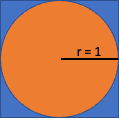

# Week 6 Bonus - Compute PI with a random generator
The number PI can be calculated by random numbers. Suppose you have a circle with radius 1 which lies in a square with a side length of 2. Then the square has an area of 4 (2 * 2) and the circle has an area of PI (r = 1, thus PI*r^2 = PI). 

If thousands of points are randomly created within the square, then some lie in the square AND in the circle, others lie in the square and not in the circle. The situation can be simplified if you just take the upper right quadrant of the above figure. This square has a side length of 1. Each point wihtin the square can be described by the coordinates `x` and `y` (0 < x, y < 1). If x\*\*2 + y\*\*2 < 1, then the point specified by (x,y) is as well within the circle.

As the relation between the sizes of circle and square is PI/4, the relation between the points in the circle and the points in the square must be PI/4 as well. Using this formula, one can now use a random number generator to calculate PI.

## Your Task
Using the library `random` create 10.000 points in the square, that means generate values for `x` and `y` (The random value must be between 0 and 1). Check, if x\*\*2 + y\*\*2 is < 1. If this is the case, then the point lies within the circle. Count the total number of points and the points which lie in the circle. Use these numbers to calculate PI. Compare your random PI with the real PI, which can be found in the `math` library.

# Proposed tests
- check if random and math are imported
- check if random.random() and math.pi are used
- check if there is a loop
